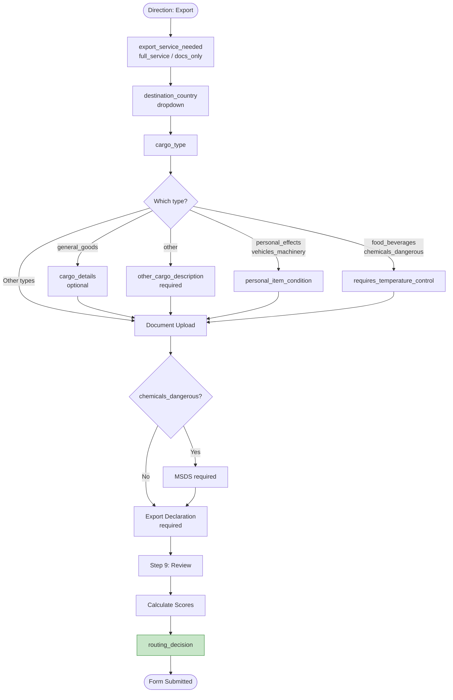
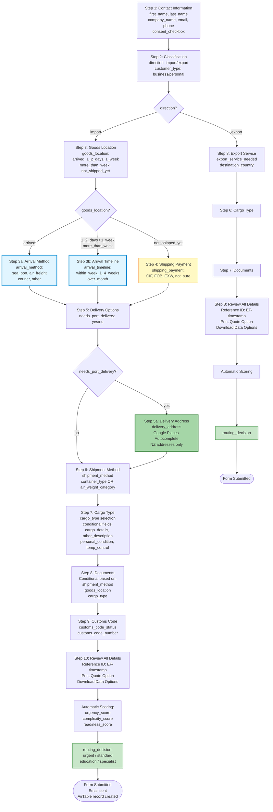
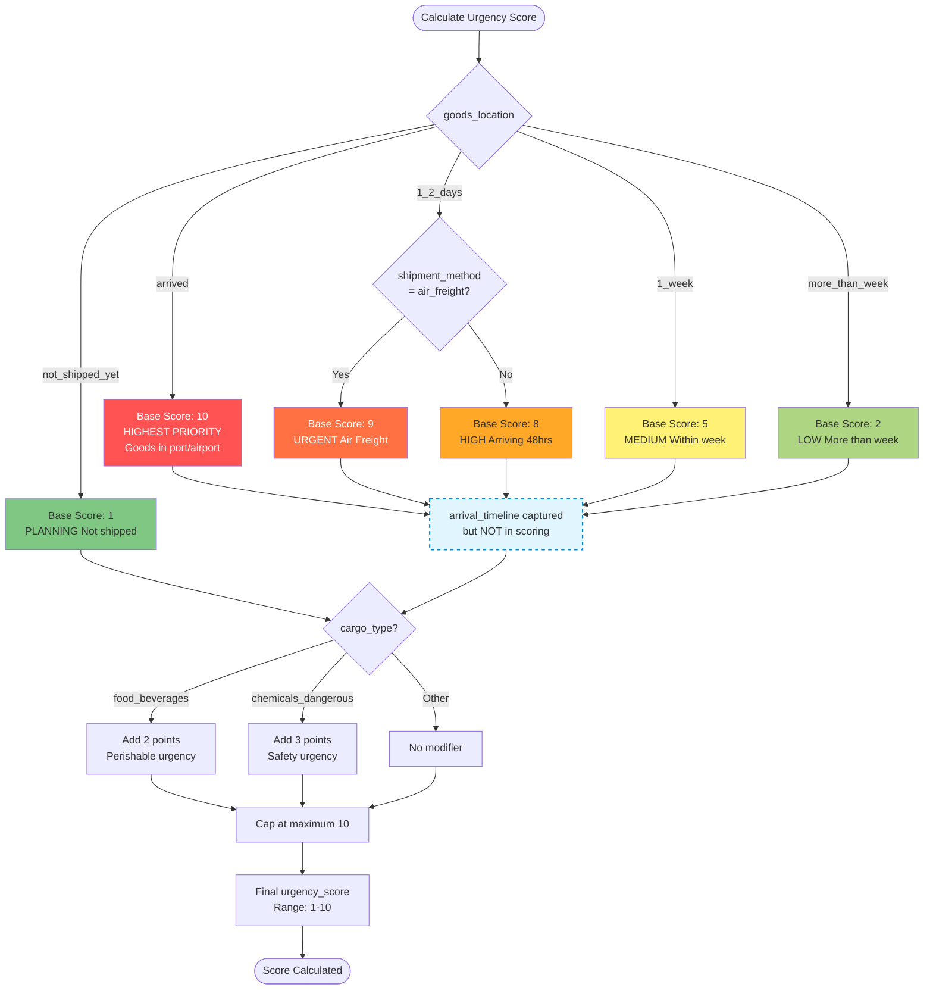
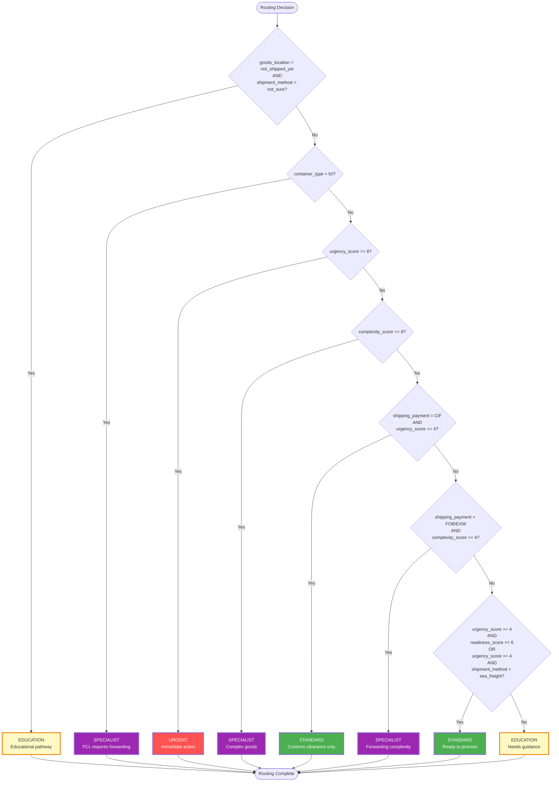

# Easy Freight - Mermaid Flowcharts

**Last Updated:** 4 November 2025  
**Compatible with**: Mermaid Live Editor, draw.io (with Mermaid plugin), Notion, Obsidian

---

## How to Use These Flowcharts

### Mermaid Live Editor (Recommended)
1. Visit: https://mermaid.live
2. Copy the code block for each flowchart
3. Paste into the editor
4. Diagram renders automatically
5. Export as PNG/SVG for documentation

### draw.io
1. Install Mermaid plugin
2. Insert → Advanced → Mermaid
3. Paste the code
4. Render diagram

### Notion/Obsidian
1. Create code block with language set to `mermaid`
2. Paste the flowchart code
3. Renders automatically

---

## Flowchart 1: Import Form Progression with Conditional Fields

**Purpose:** Shows complete import pathway with all conditional field branches

**Field Mappings:**
- All form field names match AirTable Base field names
- All conditions match Implementation Guide conditional logic
- arrival_method, arrival_timeline, and delivery_address shown in correct conditional branches

```mermaid
flowchart TD
    Start([User Starts Form]) --> Direction{direction}
    Direction -->|import| GoodsLocation[goods_location<br/>5 options]
    Direction -->|export| ExportPath[Export Pathway<br/>See Flowchart 2]
    
    GoodsLocation --> LocationCheck{Which option?}
    
    LocationCheck -->|arrived| ArrivalMethod[arrival_method<br/>WHERE arrived:<br/>sea_port / air_freight<br/>courier / other]
    LocationCheck -->|1_2_days / 1_week<br/>more_than_week| ArrivalTimeline[arrival_timeline<br/>WHEN expected:<br/>within_week / 1_4_weeks<br/>over_month]
    LocationCheck -->|not_shipped_yet| ShippingPayment[shipping_payment<br/>CIF / FOB / EXW / not_sure]
    
    ArrivalMethod --> ServiceDetails[Service Classification]
    ArrivalTimeline --> ServiceDetails
    ShippingPayment --> EducationalCheck{shipment_method<br/>selection}
    
    EducationalCheck -->|not_sure| Educational[Educational Pathway<br/>routing=education]
    EducationalCheck -->|air_freight<br/>sea_freight<br/>courier| ServiceDetails
    
    ServiceDetails --> PortDelivery[needs_port_delivery<br/>yes / no]
    
    PortDelivery -->|yes| DeliveryAddress[delivery_address<br/>Google Places<br/>NZ addresses only<br/>Optional field]
    PortDelivery -->|no| ShipmentMethod[shipment_method]
    DeliveryAddress --> ShipmentMethod
    
    ShipmentMethod -->|sea_freight| ContainerType[container_type<br/>LCL / FCL]
    ShipmentMethod -->|air_freight| AirWeight[air_weight_category<br/>under_100kg / over_100kg]
    ShipmentMethod -->|courier| CourierFlow[Courier selected]
    
    ContainerType --> CargoType[cargo_type]
    AirWeight --> CargoType
    CourierFlow --> CargoType
    
    CargoType --> CargoCheck{Which type?}
    
    CargoCheck -->|general_goods| CargoDetails[cargo_details<br/>optional text]
    CargoCheck -->|other| OtherDescription[other_cargo_description<br/>required text]
    CargoCheck -->|personal_effects<br/>vehicles_machinery| PersonalCondition[personal_item_condition<br/>used / new / both]
    CargoCheck -->|food_beverages<br/>chemicals_dangerous| TempControl[requires_temperature_control<br/>checkbox +$67]
    CargoCheck -->|Other types| Documents[Document Upload]
    
    CargoDetails --> Documents
    OtherDescription --> Documents
    PersonalCondition --> MixedCheck{condition=both?}
    MixedCheck -->|Yes| MixedCheckbox[personal_item_mixed<br/>checkbox]
    MixedCheck -->|No| Documents
    MixedCheckbox --> Documents
    TempControl --> Documents
    
    Documents --> PackingCheck{packing_list<br/>status?}
    PackingCheck -->|dont_have| PackingText[packing_info_combined<br/>manual entry required]
    PackingCheck -->|upload| CustomsCode[customs_code_status]
    
    PackingText --> CustomsCode
    CustomsCode --> CodeCheck{have_code?}
    CodeCheck -->|Yes| CodeNumber[customs_code_number<br/>8 characters]
    CodeCheck -->|No| Review[Step 9: Review]
    CodeNumber --> Review
    
    Review --> Scoring[Calculate Scores:<br/>urgency_score<br/>complexity_score<br/>readiness_score]
    Scoring --> Routing[routing_decision:<br/>urgent / standard<br/>specialist / education]
    Routing --> Submit([Form Submitted])
    
    Educational --> CargoType

    style ArrivalMethod fill:#e1f5ff,stroke:#0288d1,stroke-width:3px
    style ArrivalTimeline fill:#e1f5ff,stroke:#0288d1,stroke-width:3px
    style DeliveryAddress fill:#a5d6a7,stroke:#2e7d32,stroke-width:3px
    style Educational fill:#fff9c4,stroke:#f57c00
    style Routing fill:#c8e6c9,stroke:#388e3c
```



---

    
    PortDelivery -->|yes| DeliveryAddress[delivery_address<br/>Google Places<br/>NZ addresses only<br/>Optional field]
    PortDelivery -->|no| ShipmentMethod[shipment_method]
    DeliveryAddress --> ShipmentMethod
    
    ShipmentMethod -->|sea_freight| ContainerType[container_type<br/>LCL / FCL]
    ShipmentMethod -->|air_freight| AirWeight[air_weight_category<br/>under_100kg / over_100kg]
    ShipmentMethod -->|courier| CourierFlow[Courier selected]
    
    ContainerType --> CargoType[cargo_type]
    AirWeight --> CargoType
    CourierFlow --> CargoType
    
    CargoType --> CargoCheck{Which type?}
    
    CargoCheck -->|general_goods| CargoDetails[cargo_details<br/>optional text]
    CargoCheck -->|other| OtherDescription[other_cargo_description<br/>required text]
    CargoCheck -->|personal_effects<br/>vehicles_machinery| PersonalCondition[personal_item_condition<br/>used / new / both]
    CargoCheck -->|food_beverages<br/>chemicals_dangerous| TempControl[requires_temperature_control<br/>checkbox +$67]
    CargoCheck -->|Other types| Documents[Document Upload]
    
    CargoDetails --> Documents
    OtherDescription --> Documents
    PersonalCondition --> MixedCheck{condition=both?}
    MixedCheck -->|Yes| MixedCheckbox[personal_item_mixed<br/>checkbox]
    MixedCheck -->|No| Documents
    MixedCheckbox --> Documents
    TempControl --> Documents
    
    Documents --> PackingCheck{packing_list<br/>status?}
    PackingCheck -->|dont_have| PackingText[packing_info_combined<br/>manual entry required]
    PackingCheck -->|upload| CustomsCode[customs_code_status]
    
    PackingText --> CustomsCode
    CustomsCode --> CodeCheck{have_code?}
    CodeCheck -->|Yes| CodeNumber[customs_code_number<br/>8 characters]
    CodeCheck -->|No| Review[Step 9: Review]
    CodeNumber --> Review
    
    Review --> Scoring[Calculate Scores:<br/>urgency_score<br/>complexity_score<br/>readiness_score]
    Scoring --> Routing[routing_decision:<br/>urgent / standard<br/>specialist / education]
    Routing --> Submit([Form Submitted])
    
    Educational --> CargoType

    style ArrivalMethod fill:#e1f5ff,stroke:#0288d1,stroke-width:3px
    style ArrivalTimeline fill:#e1f5ff,stroke:#0288d1,stroke-width:3px
    style DeliveryAddress fill:#a5d6a7,stroke:#2e7d32,stroke-width:3px
    style Educational fill:#fff9c4,stroke:#f57c00
    style Routing fill:#c8e6c9,stroke:#388e3c
```

---

## Flowchart 2: Export Form Progression




---

## Flowchart 3: Complete Form Step Progression (All Pathways)

**Purpose:** Shows all form steps including conditional arrival and delivery address fields




---

## Flowchart 4: Urgency Scoring Logic




---

## Flowchart 5: Routing Decision Logic




---

## Field Mapping Reference

All flowchart field names map directly to:
- **Web Form:** JavaScript formData keys
- **AirTable Base:** Field names (columns)


| Flowchart Reference | AirTable Field Name | Type | Conditional | Status |
|---------------------|---------------------|------|-------------|--------|

### goods_location Values Clarification:

| Value | Meaning | State |
|-------|---------|-------|
| `arrived` | Goods already in NZ port/airport (arrived_nz) | Arrived |
| `1_2_days` | Arriving within 48 hours | In-transit |
| `1_week` | Arriving within one week | In-transit |
| `more_than_week` | Arriving more than a week | In-transit |
| `not_shipped_yet` | Not shipped yet | Planning |

---

## Usage Notes

2. **Color Coding:**
   - Yellow = Educational pathway
   - Green (different shade) = Standard routing
   - Red = Urgent routing
   - Purple = Specialist routing
   - Dashed blue = Captured but not yet used in logic (arrival_timeline)

3. **Conditional Logic:** All conditional branches match AirTable conditional field rules
4. **Field Names:** Use exact names from flowcharts when creating AirTable fields
5. **Google Places:** delivery_address field uses Google Places Autocomplete (NZ addresses only)

---


- **V2.0** (22 Oct 2025): Fixed Unicode characters for Mermaid v11 compatibility
- **V1.0** (Initial): Original 4 flowcharts

---

